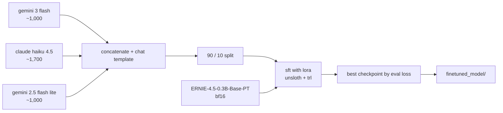

<div align="center">

# ernie-finetune

**lora fine-tuning of baidu's ernie-4.5 0.3b on distilled chat data.**
supervised fine-tuning with unsloth + trl on ~3.7k responses generated by gemini and claude.

[](https://www.python.org/)
[](https://pytorch.org/)
[](https://huggingface.co/)
[](https://github.com/unslothai/unsloth)
[](https://huggingface.co/docs/trl/)
[](https://jupyter.org/)

</div>

---

## overview

a supervised fine-tuning (sft) project that adapts the small [ERNIE-4.5-0.3B-Base-PT](https://huggingface.co/baidu/ERNIE-4.5-0.3B-Base-PT) base model into a conversational assistant. the training data is instruction / response pairs produced by larger frontier models, so the small model learns to imitate their answers (sequence-level knowledge distillation). everything lives in one notebook, [`main.ipynb`](main.ipynb).

---

## how it works



1. load three hugging face datasets and concatenate them
2. wrap each pair in a chatml-style template with a fixed system prompt
3. split 90 / 10 into train / eval (seed 42)
4. attach lora adapters to every attention and mlp projection
5. train with `SFTTrainer`, evaluating every 50 steps and keeping the best checkpoint by eval loss
6. sanity-check generation, then save model + tokenizer to `finetuned_model/`

---

## datasets

| dataset | source | size | description |
|---|---|---|---|
| gemini 3 flash preview | [TeichAI/gemini-3-flash-preview-1000x](https://huggingface.co/datasets/TeichAI/gemini-3-flash-preview-1000x) | ~1,000 samples | responses generated by google's gemini 3 flash model |
| claude haiku 4.5 | [TeichAI/claude-haiku-4.5-1700x](https://huggingface.co/datasets/TeichAI/claude-haiku-4.5-1700x) | ~1,700 samples | responses generated by anthropic's claude haiku 4.5 |
| gemini 2.5 flash lite | [TeichAI/gemini-2.5-flash-lite-2509-preview-1000x](https://huggingface.co/datasets/TeichAI/gemini-2.5-flash-lite-2509-preview-1000x) | ~1,000 samples | responses generated by google's gemini 2.5 flash lite model |

**total**: ~3,700 examples (training set: 90%, evaluation set: 10%)

### data format

each example consists of:
- **system prompt**: "you are a helpful assistant that provides detailed and accurate responses based on the user's input."
- **user message**: the input instruction or question
- **assistant response**: the target completion

```
<|im_start|>system
{system_prompt}<|im_end|>
<|im_start|>user
{user_message}<|im_end|>
<|im_start|>assistant
{assistant_response}<|im_end|>
```

---

## model

**base model**: [baidu/ERNIE-4.5-0.3B-Base-PT](https://huggingface.co/baidu/ERNIE-4.5-0.3B-Base-PT)

| parameter | value |
|---|---|
| architecture | Ernie4_5ForCausalLM |
| model type | causal language model |
| hidden size | 1,024 |
| number of layers | 18 |
| number of attention heads | 16 |
| key-value heads | 2 |
| head dimension | 128 |
| intermediate size | 3,072 |
| hidden activation | SiLU |
| vocabulary size | 103,424 |
| max sequence length | 131,072 |
| data type | bfloat16 |

### lora configuration

| parameter | value |
|---|---|
| lora rank (r) | 16 |
| lora alpha | 64 |
| scaling factor | 4.0 (alpha / rank) |
| target modules | q_proj, k_proj, v_proj, o_proj, gate_proj, up_proj, down_proj |
| bias configuration | none |
| rslora | false |
| gradient checkpointing | enabled (unsloth variant) |

---

## training hyperparameters

| parameter | value |
|---|---|
| optimizer | adamw 8-bit |
| learning rate | 5e-5, cosine schedule |
| warmup steps | 100 |
| weight decay | 0.01 |
| per-device batch size | 32 |
| gradient accumulation | 2 (effective batch 64) |
| max sequence length | 4,096 |
| packing | enabled |
| epochs | 5 |
| total training steps | 260 |
| eval / checkpoint interval | every 50 steps (max 3 checkpoints kept) |
| early stopping | patience of 5 evaluations on eval loss |
| best model | restored at the end (`load_best_model_at_end`) |

---

## results

numbers from the original training run (notebook outputs are not committed):

| metric | value |
|---|---|
| initial training loss (step 10) | 1.434 |
| best evaluation loss | **1.289** at step 100 (epoch ~1.9) |
| final training loss (step 260) | ~1.26 |

- loss dropped fastest during the first epoch
- eval loss bottomed out at step 100, so that checkpoint is the one kept
- gradient norms decreased as training progressed

---

## getting started

needs an nvidia gpu with cuda (the notebook trains in bf16 and runs inference on `cuda`).

```bash
git clone https://github.com/kjhq/ernie-finetune.git
cd ernie-finetune
uv venv --python 3.12
uv pip install unsloth trl transformers datasets scikit-learn jupyterlab
uv run jupyter lab main.ipynb
```

run the cells top to bottom. checkpoints go to `outputs/` and the final model + tokenizer to `finetuned_model/` (both git-ignored).

---

## project structure

```
ernie-finetune/
├── main.ipynb    # data prep, lora setup, training, inference test, save
└── .gitignore    # outputs/, finetuned_model/, unsloth cache
```

---

## references

- [baidu ernie-4.5 0.3b base](https://huggingface.co/baidu/ERNIE-4.5-0.3B-Base-PT)
- [unsloth](https://github.com/unslothai/unsloth)
- [trl documentation](https://huggingface.co/docs/trl/)
- [lora: low-rank adaptation of large language models](https://arxiv.org/abs/2106.09685)

---

**created**: december 2025 · **training framework**: unsloth + trl

---

<div align="center">

built by [kjhq](https://kjhq.dev) · [@kjhqdev](https://x.com/kjhqdev)

</div>
